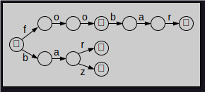
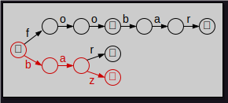

==========================
Lab 4: Fake Virtual Memory
==========================

.. contents:: Contents
    :depth: 2

TL;DR
=====

Deadlines
---------

- Tasks 1, 2: 2024-03-04, 23:59 Vancouver time
- Tasks 3–5: 2024-03-10, 23:59 Vancouver time

Objective
---------

In this lab, you will create a (much) simplified emulation of virtual memory system. Of course you won't be doing this inside a kernel, so we have instead defined an API that can be used to map and unmap pages, and so on. You'll implement the Real Thing™ in CPEN 331.

Logistics
---------

As in the prior lab, we will use ``castor.ece.ubc.ca`` to evaluate your submissions, so your code must work there. All submissions are made by committing your code and pushing the commits to the main branch of the assignment repo on GitHub before the deadline for the relevant task(s).

As with all work in CPEN 212, everything you submit must be original and written by you from scratch after the lab has been released. You may not refer to any code other than what is found in the textbooks and lectures, and you must not share code with anyone at any time. See the academic integrity policy for details.

Be sure that you are submitting only **working code**. If your code does not compile, does not link, or crashes, you will receive **no credit** for the relevant task. It's much better to submit code with less functionality that is well-tested and works than code that has more features but does not compile or crashes.

Do not rename any directories, functions, or variables provided in the templates, and do not change any types in the existing declarations. Do not define global functions that are not in the header (you may add functions declared as ``static``, though); for example, if you define ``main`` in the deliverable files, it will clash with our marking code. If you do any of these things, your code will fail to compile and/or link, and you will end up with a 0 for the relevant task.

After task 2, tasks are cumulative: for example, if your translation doesn't work then there is no way for us to test whether you constructed the page tables correctly.

Make sure you review the virtual memory lectures and understand how the multi-level page table structure works, and how addresses are translated.

Advice
------

Unlike in the memory allocation lab, we are not providing extensive sample traces for you. This means you will need to create test cases yourself. If you don't thoroughly test your code, it is very unlikely that your code will pass any tests.

You'll want to automate tests rather than run them by hand. It's best to run all of them whenever you make changes as a *regression testsuite* to make sure you haven't broken anything. It's very easy to write a simple Makefile that runs all of your tests after the code builds.

In fact, it's a good idea to write test cases based on the spec *before* implementing anything. The reason is that this will force you to think about the corner cases, and you're not unlikely to find that there are some details that you actually don't understand... and it's much easier to address that before you start writing code than when you have a full implementation based on a misunderstanding.

Like in the memory allocation lab, for the later tasks you will almost certainly want to write some helper functions that pretty-print various things in a human-readable way: the page hierarchy, the set of all mapped pages, etc. This is even more important than in the allocation lab, since there are multi-level data structures here.

Task 1
======

In this task you will implement a set of strings as a trie. This is a very simple data structure that has some important similarities to the page table hierarchy in many virtual memory systems.

Tries
-----

It's easiest to show a trie by example. Let's look at one that can store only letter sequences; in this example, it contains the strings "foo", "bar", "baz", and "foobar", as well as the empty string "".

Each node has a set of child nodes identified by the letters of the alphabet; some children exist and some don't. To look things up in this trie, we use each letter in our query string to go to the appropriate node in the next level of the trie. For example, when we're looking up "baz", we follow the red path:

When we run out of letters, we check whether the node we're at has its presence bit set (checkmark in the diagram); if so, the string is in our trie. If the presence bit is not set, then the string is not in the trie; for example, looking up "f" in the diagram terminates at a node without a checkmark. If at any point we find that there is no child corresponding to a specific letter, we know that the string cannot be in the trie; this would happen, for example, if you were to look up "fork" in the trie above.

Note that adding and deleting strings does not affect any other strings in the trie. For example, deleting "foobar" from the trie above leaves "foo" in the trie, and deleting "foo" leaves "foobar" in the trie.

What you need to do
-------------------

In ``task1`` you will find ``trie.h`` and ``trie.c``. Fill in ``trie.c`` to implement all required functions as described in ``trie.h``.

As usual, your code cannot add any global functions (e.g., ``main``) other than the ones defined in the template, and it may not rely on any files other than ``trie.h`` and ``trie.c``; we will also use the original version of ``trie.h``, so you if you rely on modifications there your code won't work. You may allocate memory on the heap, but only using the ``malloc`` function, and your code may not write anything to the console or any other files.

Note that we will test your lookup with our own new and insert implementations, and vice versa. This means you must implement the trie using the data structure described in ``trie.h``.

Deliverables
------------

In ``task1``:

- ``trie.c``

Fake virtual memory
===================

Representation
--------------

Since in this lab we are faking the virtual memory mechanisms outside the kernel, we don't have direct access to the machine's physical memory. Instead, like in the allocator lab, we will give you a region of memory as an argument to an ``init`` function, and we'll pretend it is the machine's entire physical memory.

All "physical" addresses we use in this lab (type ``paddr_t``) will therefore be *relative* to the start of this physical memory: for example, physical address 0 will identify the first byte of the region we give you.

Similarly, a real OS associates virtual memory areas with address space IDs, with separate processes running in separate address spaces; but we have no access to that either. Instead, we will have "fake" address space IDs (type ``asid_t``), which we will use to distinguish separate fake virtual memory spaces.

VM configuration
----------------

The memory system parameters you need to implement has the following parameters:

- virtual addresses are 32 bits,

- physical addresses are 32 bits, and

- pages are 4096 bytes each.

Physical memory contains at least 4 pages and no more than 1,048,320 pages.

Swap space, if present, is at least 2 pages and no more than 67,108,864 pages.

The page table is hierarchical, with first-level and second-level page tables in addition to pages allocated for the application. To address them, a virtual address VA is split into the following bit ranges:

- VA[31:22] indexes the first-level page table,

- VA[21:12] indexes the second-level page table, and

- VA[11:0] is the page offset.

The system supports up to 512 *concurrent* address spaces, with ASIDs 0 to 511 inclusive, each with their own page table hierarchy. Note that more address spaces may exist over time if some address spaces are destroyed, but only 512 must be supported concurrently.

All pages, including page table levels, are aligned on 4096-byte boundaries.

Operations
----------

The VM system supports four operations: memory accesses, mapping, unmapping, and eviction policy reset.

**Accesses** to virtual memory addresses may be of three types:

- read access,

- write access, and

- instruction fetch.

These accesses will fail unless the appropriate permission bits are set in the relevant page table entry.

Accesses may be made from user-level code or kernel-level code. User-level accesses will fail unless the relevant page table entry allows user accesses.

The **mapping** operation allocates a page in physical memory and maps it to a virtual address space, also creating any intermediate page tables that are required.

The **unmapping** operation removes a page from a virtual address space, also removing any intermediate page tables that have no valid entries. Unmapping does not deallocate an address space ID's toplevel table.

The address space can be **created** (which allocates the top-level page table) or **destroyed** (which deallocates all physical memory used by this address space).

Page table entries
------------------

Each page table entry is 32 bits; when stored in memory or on disk, the 32-bit value appears in little-endian byte order.

Page table entries (PTEs) comprise the following bitfields:

- PTE[31:12] (ppn) physical page number
- PTE[11:7] (reserved) reserved, must be zero
- PTE[6] (accessed) indicates that this page was used for translation since it was created (or, generally, the last time accessed bits were reset)
- PTE[5] (user) indicates that user-level accesses to this page are permitted (otherwise kernel-level only)
- PTE[4] (executable) indicates that instruction fetches from this page are permitted
- PTE[3] (writable) indicates that writes to this page are permitted
- PTE[2] (readable) indicates that reads from this page are permitted
- PTE[1] (present) indicates that this page is resident in physical memory
- PTE[0] (valid) indicates that this page is mapped in the current virtual address space (and may or may not be resident)

In PTEs where valid = 0, all other bits are reserved for the implementation.

In PTEs where valid = 1 and present = 0, bits [31:6] are reserved for the implementation.

In PTEs that identify a next-level page table, the four permission bits (user/executable/writable/readable) are reserved for the implementation and must be ignored during translation lookups.

Swapping
--------

If swap space is present, pages in physical memory may be swapped out of physical memory. Both pages allocated to for process data and page tables may be swapped out. The contents and permissions for evicted pages must be preserved when they are swapped back to physical memory.

Swapping may occur in two scenarios:

- A PTE points to a page where valid = 1 but present = 0. This may occur during accesses, mapping, or unmapping. The relevant page is brought to physical memory, with another page swapped out only if no free pages remain in physical memory.

- A new page must be created during mapping (for either a page table or process-accessible page), but no free pages remain in physical memory. A page is swapped out, creating space for the new page.

Note that either of these cases multiple swap events may be required to complete a single operation.

A page table is never swapped out unless all of the pages it points to have been swapped out.

Implementation requirements
---------------------------

The contents of any page allocated to the process for data may not be altered by the VM system.

If the physical memory has N pages total, physical page 0 may be reserved for VM system metadata, but pages 1 through N–1 must be usable either for intermediate page tables or the pages allocated to processes. For example, if there are 4 pages total, you must support a minimum of one allocatable page (in this case, two levels of PT and the page allocated for the application).

Intermediate page tables that have no valid entries must be deallocated. For example, when physical memory has 5 pages, it must be possible to allocate one process-usable page, deallocate this page, and allocate another process-usable page for a separate address space. For a physical memory with 4 pages, it must be possible to allocate one process-usable page, destroy the address space, and allocate another process-usable page in a new address space.

If the physical page has N pages total and the swap space has M pages total, the total number of usable pages in the entire system is (N–1) + (M–1).

Coding
======

Templates
---------

For each task, we've provided a header file ``cpen212vm.h`` that defines the API to your implementation, and a skeleton ``cpen212vm.c`` file where you will fill in your implementation. The templates are the same for task 2 and later tasks.

Constraints
-----------

Some constraints you must obey when writing code:

- When compiling your code, we will only use ``cpen212vm.c`` in the relevant directory; we will use a fresh copy of ``cpen212vm.h``. This means that all your code must be in ``cpen212vm.c``.

- You may define whatever additional functions you like, provided they are not visible in the global linker namespace (i.e., they are declared as ``static``).

- You may not use global variables (even if they are ``static``).

- You may not allocate any memory (e.g., using ``malloc``) beyond the physical memory range provided to ``vm_init()``.

- You may not use any names that start with a double underscore (e.g., ``__foo``).

- Your code must be in C (specifically the dialect used by default by the globally-installed ``gcc`` on ``castor``).

- Your code must not require linking against any libraries other that the usual ``libc`` (which is linked against by default when compiling C).

- Needless to say, your code must compile and run without errors. If we can't compile or run your code, you will receive no credit for the relevant task.

- No function you implement may take longer than 5ms.

If you violate these rules, we will likely not be able to compile and/or properly test your code, and you will receive no credit for the relevant task(s).

Task 2
======

Requirements
------------

Required functionality:

- given a non-NULL physical memory region, successful initialization with ``vm_init``

- given a handle returned by ``vm_init``, correctly translating in ``vm_translate`` for accesses to virtual addresses resident in the physical memory given to ``vm_init``

- correct errors for unmapped addresses

- all translation permission checks and suitable failures

- swap functionality not required: ``swap`` will be NULL when ``vm_init`` is called

Smoke test
----------

We have provided a very, very basic smoke test in ``smoketest.c`` to help you check that your translation code is not in a completely different galaxy. This test is **not sufficient** to determine whether your code works; you will need to write your own tests.

Deliverables
------------

In ``task2``:

- ``cpen212vm.c``

Task 3
======

Requirements
------------

Required functionality in addition to previous tasks:

- creating new top-level translation tables with ``vm_new_addr_space``

- mapping new pages in existing address spaces with ``vm_map_page`` provided there are enough free physical memory pages

- creating any intermediate page tables necessary to complete the mapping

- removal of any intermediate tables created during the current mapping if the mapping ultimately fails

- relevant failures (e.g., out of memory, duplicate, etc.)

- swap functionality not required: ``swap`` will be NULL when ``vm_init`` is called

Deliverables
------------

In ``task3``:

- ``cpen212vm.c``

Task 4
======

Requirements
------------

Required functionality in addition to previous tasks:

- unmapping existing pages with ``vm_unmap_page``, provided all levels are resident in physical memory

- removal of any intermediate page tables that have no valid entries

- destroying an entire address space via ``vm_destroy_addr_space``, provided all levels are resident in physical memory

- all relevant failures

- swap functionality not required: ``swap`` will be NULL when ``vm_init`` is called

Deliverables
------------

In ``task4``:

- ``cpen212vm.c``

Task 5
======

Requirements
------------

Required functionality in addition to previous tasks:

- all relevant functions evict process-allocated pages to the swap file if the usable physical memory is full but there is usable space in the swap

- all relevant functions can retrieve process-allocated pages from the swap file

- unmapping pages and destroying address spaces works even if pages have been swapped out

- eviction candidates may be limited to the process-allocated pages belonging to process initiating the access or the mapping (in this task only)

- all relevant failures

Deliverables
------------

In ``task5``:

- ``cpen212vm.c``

Bonus
=====

Requirements
------------

Required functionality in addition to previous tasks:

- intermediate page tables must be evictable

- if eviction is required, pages that have not been accessed via ``vm_translate`` must be evicted *before* pages which have been accessed

Deliverables
------------

In ``bonus``:

- ``cpen212vm.c``

Marks
=====

To earn marks, you must commit and push each task to the GitHub repo **before the deadline for that task**.

Remember that CPEN 212 labs are **individual**, so you must complete all tasks by yourself; see the academic integrity policy for details.

- Task 1: 2
- Task 2: 2
- Task 3: 2
- Task 4: 2
- Task 5: 2
- Bonus: 1

We test features incrementally, so the tests for later tasks rely on previous tasks working (with the exception of task 1).
